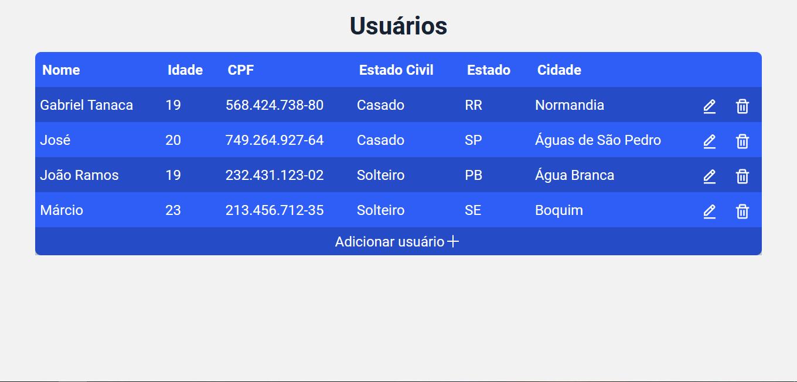

<h1 align="center">
    Tabela de Usuários
</h1>

<h1 align="center">
    
</h1>

<h3 align="center">
   💾 <a href="https://table-c6f84.web.app/">Acessar a demonstração</a>🔗
<h3 >

# Indice

- [Sobre](#-sobre)
- [Relatório](#-relatório)
- [Tecnologias Utilizadas](#-tecnologias-utilizadas)
- [Como baixar o projeto](#-como-baixar-o-projeto)

## 🔖 Sobre

O projeto foi desenvolvido com o propósito da criação de usuários dentro de uma tabela, tendo alguns requisitos mínimos a ser atendidos

- Inserir conteúdo na tabela
- Editar o conteúdo da tabela
- Remover conteúdo da tabela

---

## 📰 Relatório` `

As tecnologias utilizadas para esse projeto está indicada no tópico 🚀[Tecnologias Utilizadas](#-tecnologias-utilizadas). Utilizando o ReactJS, podemos usar algumas de suas ferramentas como o `useState()` e o `useEffect()` para muitas funcionalidades, com o `useEffect` foi possível requisitar os dados do banco do firebase para nossa aplicação e utilizando um `forEach` podemos separa-los em um array de usuários , assim fazendo a criação de um back-end bem simples com o uso da ferramenta e o `useState` foi utilizado para completar na hora de alterações dos parâmetros do usuário. Além disso o próprio firebase facilitou na hora de desenvolver as funções para alterar, deletar e criar o usuário, aonde dentro das funções ` saveUser()`, `deleteUser()` e `alterUser()`, puxando da collection os dados e então podendo exluí-los, ou então a partir do 'id' do 'user' poder alterar o 'user', para salvar, utilizei uma Promise para que possamos criar um objeto assíncrono, logo podendo estar disponível no momento ou depois dele.

O Typescript com seu poder de "tipagem" foi muito útil na hora de colocar parâmetros, para isso criei a Interface `UsersI` a qual contém os dados necessários para a criação de um novo usuário. Utilizei o Axios para requisitar uma [Api do IBGE](https://servicodados.ibge.gov.br/api/docs/localidades#api-UFs-estadosGet) de cidades e estados, a qual procurei no google, assim pude fazer um select com apenas um `.map()` nos dados da api. Para a estilização da tabela utilizei o React-Bootstrap a qual já criei uma tabela e os selects bem rápidos, utilizando a linha da tabelas para a criação e alteração do usuário, utilizando os components da framework, e por fim utilizei o styled-components para dar uma estilizada na página e na própria tabela.

---

## 😥 Dificuldades durante o desenvolvimento

Na hora de criar as linhas da tabela estava sem entender como poderia fazer então depois de um tempo preferir fazer uma adição e edição a partir de um if ternário, aonde quando eu apertasse o botão de adicionar mudava o estado de criação para true, criando uma linha a mais em baixo da tabela, e aonde os dados ficariam coloquei inputs no começo, mas pensei que poderia melhorar, então coloquei alguns selects, puxei uma api de cidades e locais para que pudesse ser algo melhor na hora da escolha, não podendo colocar qualquer coisa que viesse à cabeça, isso támbem para os estados e os estados civis. Por fim demorei para criar a lógica da implementação dos dados.

Tive uma dificuldade na hora de utilizar os selects, pois esses não alteravam na hora de selecionar uma das opções, então tentei encontrar o erro, por sorte vi que estava em um loop aonde o value da option estava errado, fazendo com que mesmo que seleciona-se outro valor, ele voltava ao valor inicial.

A minha maior dificuldade foi na hora de alterar e criar as linhas, mas o if ternário ajudou muito com o setState, havia pensado outras formas como um formulário de preenchimento, tanto que na minha primeiro tentativa estava pensando em colocar uma sidebar para transitar entre o form e o dashboard.

Mas decidi fazer algo mais rápido e eficiente, pensando em que essa tabela poderia ser utilizada por um usuário ou uma equipe de recrutadores, assim facilitando a vida na hora de adicionar pessoas na tabela.

---

## 🚀 Tecnologias utilizadas

O projeto foi desenvolvido utilizando as seguintes tecnologias

- [ReactJS](https://reactjs.org)
- [Styled-components](https://styled-components.com/)
- [React-Bootstrap](https://react-bootstrap.netlify.app/)
- [Typescript](https://www.typescriptlang.org/)
- [Axios](https://blog.rocketseat.com.br/axios-um-cliente-http-full-stack/)
- [Firebase](https://firebase.google.com/)

---

## 🗂 Como baixar o projeto

```bash

    # Clonar o repositório
    $ git clone https://github.com/gabrieltanaca/Table-SoftWarp.git

    # Entrar no diretório
    $ cd Table-SoftWarp

    # Instalar as dependências
    $ yarn install

    # Iniciar o projeto
    $ yarn start
```

---

Desenvolvido 🕹 por Gabriel Tanaca Ramos
